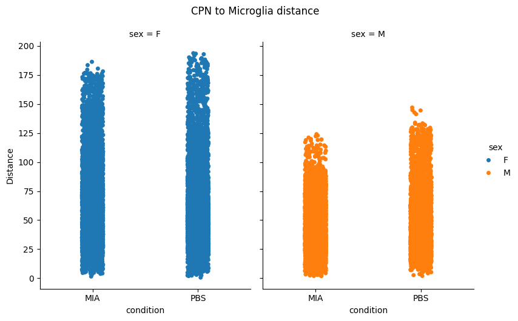
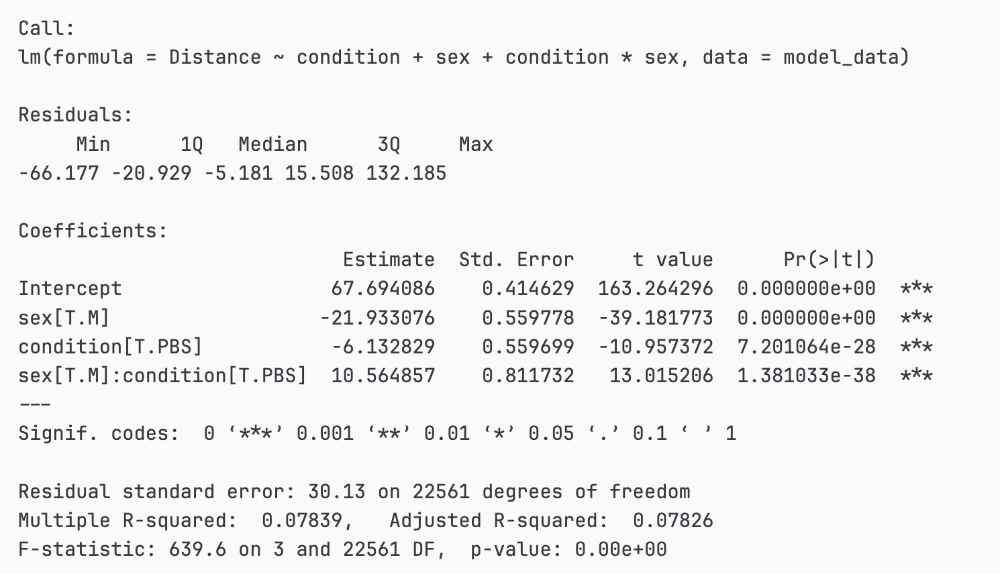
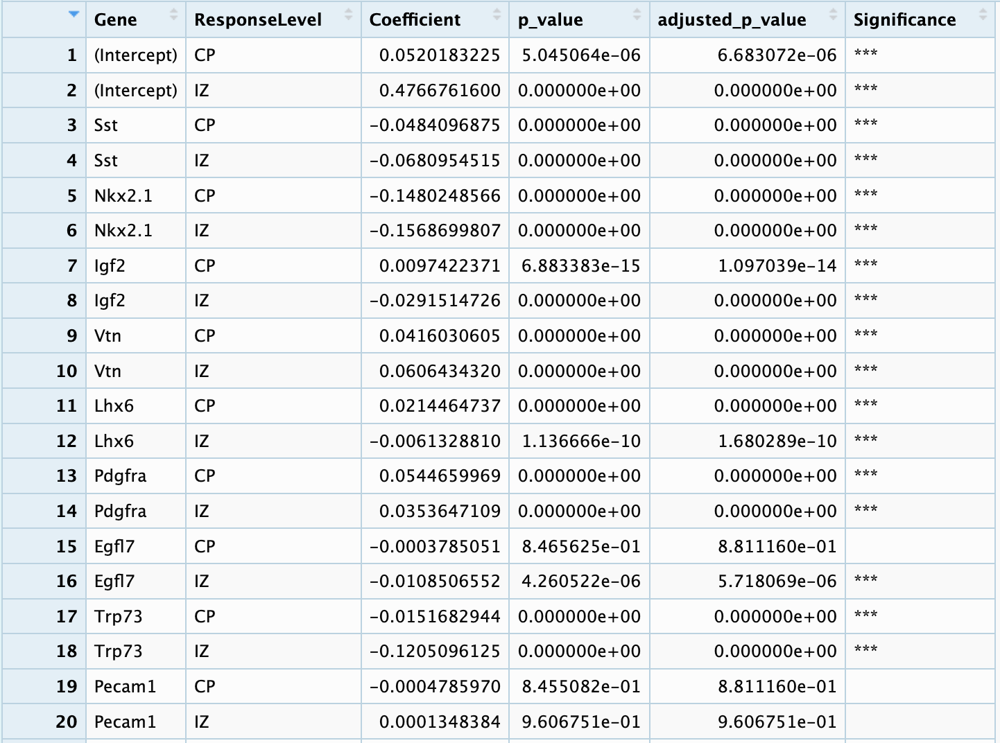
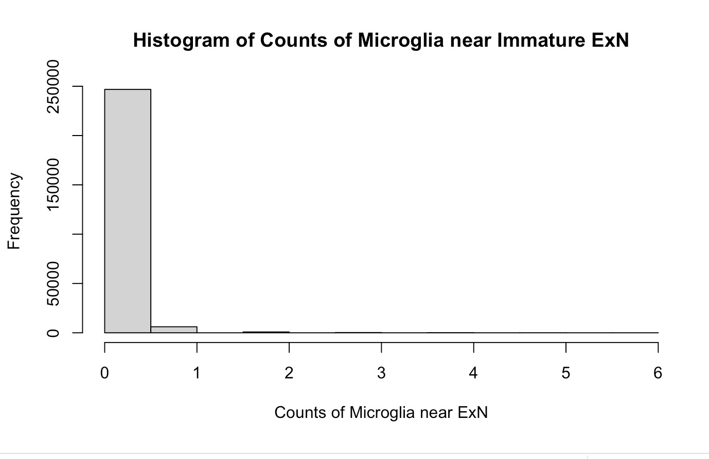
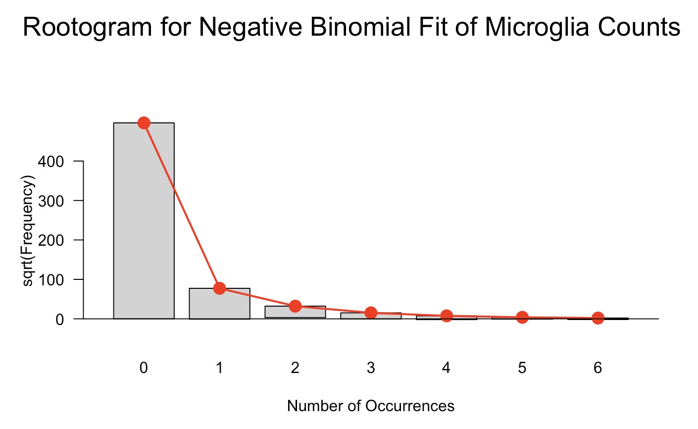

**Group 10: Spatial Minds**

**Members:**

- Wuxinhao (Tim) Cao

- Junyang Deng

- Caroline Song

**I have read and attest to the statement in the BST 210 HW assignment**

**Date:** November 10, 2024

### Question 2

#### a. Literature Review

Our group conducted a literature review to inform our project, focusing on research in neuroscience and spatial transcriptomics, particularly studies using the MERFISH technique. Similar questions have been explored, such as the relationship between biological sex, gene expression, and spatial cell distribution. In these studies, researchers frequently apply spatial regression models, generalized linear models, and various spatial statistics to investigate these associations.

We plan to integrate these approaches into our analysis, emphasizing spatial regression techniques and modeling complex interactions (e.g., sex and disease state) to refine our models. One commonly used method identifies the proportion of a specific cell type (cell B) within a defined radius around another cell type (cell A) and compares these proportions under control and diseased states to assess if disease alters cell proximity. However, this technique doesn’t differentiate the precise spatial locations of cell B within that radius. It only measures the presence of cell B within the region, rather than how close cell B actually is to cell A.

To establish a background distribution for comparison, the authors generate a null distribution by randomizing the locations of cell type B cells within the spatial area. The proximity enrichment is then expressed as the log2 ratio of true to background. They calculate a Z-score for statistical significance as follows:

$$
z = \frac{\text{true} - \text{background}}{\text{background sd}}
$$

where `background_sd` is the standard deviation of the background distribution. This Z-score is used to adjust for multiple comparisons across all cell type pairs using the False Discovery Rate (FDR). Inspired by this approach, our method will adapt similar spatial quantification but focus on distance-based metrics to assess the spatial distribution changes under different experimental conditions.

Our approach builds on these insights by measuring the actual distance between cell A and its closest cell B, providing a more nuanced view of cell proximity in relation to disease. This method allows us to better capture changes in cellular spatial relationships in disease contexts, which might be overlooked in simpler proportion-based analyses.

**References:**

- Karlstad, J., Blasi, T., Busskamp, V., & Zador, A. M. (2022). Spatially resolved single-cell transcriptomics reveals cell type–specific patterns of organization in the mouse brain. *Cell, 185*(1), 92-106.e18.

- Xiaowei Zhuang et al. (2023), MERFISH Spatial Transcriptomics Dataset of a Single Adult Mouse Brain

- Kalish et al. (2021), Maternal Immune Activation in Mice Disrupts Proteostasis in the Fetal Brain.

- Chennuru Vankadara, S., & von Luxburg, U. (2018), Distance-Preserving Generative Models for Spatial Transcriptomics.

#### b. Peer review

We have received several constructive insights from our peers and the teaching team, which have been instrumental in refining the direction of our project. The feedback can be summarized as follows:

1. **Data Complexity:** The high-dimensional nature of the data poses challenges, especially regarding potential overfitting and computational inefficiencies due to numerous covariates (e.g., gene expression, cell locations). Reviewers recommended incorporating regularization techniques such as LASSO to reduce the number of variables and improve model performance.

2. **Model Simplification:** Reliance on linear models may be a limitation as they might not fully capture the complexity of gene expression and spatial relationships, potentially leading to an oversimplified analysis. Reviewers advised exploring more flexible models such as Generalized Additive Models (GAMs) or splines, especially for continuous covariates like gene expression and spatial distances, to better capture complex relationships.

3. **Biological Interpretation of Spatial Data:** Translating results into meaningful biological insights can be challenging. Advanced spatial statistics or domain-specific interpretations are needed to better understand the biological significance of cell distances and gene expression patterns.

##### i.

- **Yes**, the feedback provided by both our peers and the teaching team included insights that were directly viable for shaping the direction of our project.

##### ii.

- We have responded to the feedback and made the following modifications:

1. **Limitations of the Linear Model:** Recognizing that a linear model might not be suitable for our research question, we shifted our analysis towards a Negative Binomial model, which is more appropriate for our count-based outcomes and allows for overdispersion. This change ensures our model aligns better with the data characteristics.

2. **Model Simplification:** By switching to a Negative Binomial model, we streamlined our modeling approach, making it more compatible with our data and addressing computational limitations.

3. **Refined Research Questions:** We redefined our primary and secondary research questions to enhance clarity and relevance:
   - **Primary Question:** Does the colocalization of two cell types of interest change under control versus diseased conditions? We will analyze 552 possible cell pairs (24 cell types).
   - **Secondary Question:** Does cell type enrichment vary across nine brain regions and between control and diseased states? This analysis involves assessing 24 cell types within each of the nine brain regions of interest.

#### c. Domain expertise

**Yes**, we have contacted the domain expert, Dr. Brian Kalish (Boston Children’s Hospital), to seek guidance on interpreting the spatial distribution and colocalization patterns of the cell types under different conditions. Dr. Brian Kalish’s insights have been valuable in refining our approach to analyzing cell-type enrichment across brain regions and ensuring our methodological choices align with current best practices in spatial transcriptomics.

### Question 3 Analysis Plan

1. **Calculate the Density Factor $d_i$**  
   For each tissue sample $i$, compute the density factor by taking the mean of all nearest-neighbor distances $d_{ij}$ between each cell pair $j$:
   $$
   d_i = \frac{1}{N_i} \sum_{j=1}^{N_i} d_{ij}
   $$
   where $N_i$ is the number of cells in sample $i$.

2. **Determine the Hyperparameter $n$**  
   Select the hyperparameter $n$ by performing a sensitivity analysis to scale the density factor, defining the radius $r_i$ as:
   $$
   r_i = n \times d_i
   $$

3. **Generate Cell Type Pairs**  
   Create all possible pairs of distinct cell types to analyze their spatial interactions within each tissue sample.

4. **Count Nearby Cells $Y_{ij}$**  
   For each cell of type B in sample $i$, count the number of type A cells within the radius $r_i$, resulting in the count variable:
   $$
   Y_{ij} = \text{Number of type A cells within } r_i \text{ of cell } j \text{ of type B}
   $$

5. **Fit the Full Negative Binomial Model**  
   Model the counts $Y_{ij}$ using Negative Binomial regression, including the experimental condition and, if applicable, random effects:
   $$
   Y_{ij} \sim \text{Negative Binomial}(\mu_{ij}, \theta)
   $$
   $$
   \log(\mu_{ij}) = \beta_0 + \beta_1 \cdot \text{Condition}_i + u_i \quad (\text{if using random effects})
   $$

6. **Extract Rate Ratios and Confidence Intervals**  
   Calculate the rate ratio as $\exp(\beta_1)$ and derive the 95% confidence intervals using the standard error of $\beta_1$:
   $$
   \text{Rate Ratio} = \exp(\beta_1)
   $$
   $$
   \text{CI}_{\text{lower}} = \exp(\beta_1 - 1.96 \times \text{SE}(\beta_1))
   $$
   $$
   \text{CI}_{\text{upper}} = \exp(\beta_1 + 1.96 \times \text{SE}(\beta_1))
   $$
7. **Fit the Null Model**  
   Fit a Null Negative Binomial model without the condition effect to serve as a baseline for comparison:
   $$
   Y_{ij} \sim \text{Negative Binomial}(\mu_{ij}, \theta)
   $$
   $$
   \log(\mu_{ij}) = \beta_0 + u_i \quad (\text{if using random effects})
   $$

8. **Perform Likelihood Ratio Test (LRT)**  
   Compare the full model and the null model using LRT to assess the significance of the condition effect:
   $$
   \text{LRT} = \text{anova}(null\_model, nb\_model)
   $$

9. **Adjust for Multiple Testing**  
   Apply the Benjamini-Hochberg method to adjust p-values obtained from the LRT for multiple comparisons:
   $$
   p_{\text{adj}} = \text{p.adjust}(p\_value, \text{method} = 'BH')
   $$

10. **Visualize Results with Heatmaps**  
    Create heatmaps of the log2 rate ratios for all cell type pairs, highlighting statistically significant interactions based on the adjusted p-values.

11. **Conduct Sensitivity Analysis on \(n\)**  
    Evaluate the robustness of the results by repeating the analysis with different values of the hyperparameter \(n\) and comparing the outcomes.

12. **Interpret Biological Implications**  
    Analyze the significant rate ratios and their confidence intervals to draw conclusions about how experimental conditions affect the spatial relationships between different cell types.

### Question 4 Missing Data

#### a. Type of missingness

The source of data is MERFISH (Multiplexed Error-Robust Fluorescence In Situ Hybridization), which is highly effective at mitigating issues of missing data in the gene expression matrix. MERFISH is designed with robust error-correction capabilities that correct barcode errors by assigning ambiguous barcodes to their closest valid match. This approach significantly reduces the likelihood of missing gene expression data. Thus, our dataset does not exhibit missing data in the gene expression matrix.

MERFISH data also provides spatial coordinates for each cell, enabling us to conduct spatial analyses without concerns about missing values in either expression or location data. Because of this error robustness and complete spatial mapping, our dataset does not contain missing data in any critical variables for our analysis.

**Conclusion:**
Due to the inherent strengths of the MERFISH technology in error correction and spatial localization, there is no need to handle missing data in this project. We can proceed with our analysis with confidence that the dataset is complete and reliable for both gene expression and spatial location information.

#### b. Steps to Address Missing Data

Given that our dataset is generated from MERFISH, which includes robust error-correction capabilities that virtually eliminate missing gene expression data and provide complete spatial coordinates, no missing data imputation or exclusion is necessary. Consequently, we have not implemented any missing data handling procedures in our analysis.

### Question 5 Modeling

#### a. Linear, flexible/additive, or other methods (LASSO, ridge)

Our analysis plan does not include this type of model, therefore we figure out a way apply these models.

For one cell type pair (cell type A and cell type B), we can fit a model as follows:

$$
\text{Distance}_i = \beta_0 + \beta_1 \cdot \text{Sex}_i + \beta_2 \cdot \text{Condition}_i + \beta_3 \cdot \text{Sex}_i \cdot \text{Condition}_i+ \epsilon_i
$$

Where:
- $Y_i$ is the distance from cell type A to cell type B in sample \(i\).
- $\text{Sex}_i$ is the biological sex of the sample, $Sex_i=1$ if male, and $sex_i=1$ if female.
- $\text{Condition}_i$ indicates whether the sample is under control or diseased conditions. $condition_i=1$ if condition is MIA, else 0.

This model can be used in the EDA part to help us understand how distances between cell types change in different experimental condition and biological sex. There are 25 different cell types in our dataset, so we will need to fit $25\times 24$ linear regression models to understand how would conditions and sex affect cell-cell distance.

Here, we demonstrate this idea using CPN (neocortical projection neurons) and microglia. We first calculated the distance between two cell types on all samples, and organized it into a dataframe. Then, we fitted the model, where fitted coefficients are $\beta_0=67.69, \beta_1=-21.93, \beta_2=-6.13, \beta_3=10.56$. 

**Interpretation:**

- According to this sample, on average, being in the MIA condition decreases the distance between OPC and microglia by 6.13 $\mu m$ for females, compared to females in the PBS condition.

- On average, being in the MIA condition decreases the distance between OPC and microglia for males by 6.13 - 10.56 = -16.69 $\mu m$ compared to males in the PBS condition. This suggests a larger reduction in distance for males than for females when in the MIA condition.

- The positive interaction term $\beta_3 = 10.56$ $\mu m$ indicates that the effect of the MIA condition on the distance between OPC and microglia differs by sex. Specifically, males in the MIA condition have an additional 10.56 $\mu m$ increase in distance relative to the main effect of condition, partially offsetting the reduction observed in females. This suggests that the MIA condition reduces the distance more for males than for females, with sex modifying the impact of condition on distance.

  

#### b. Logistic, multinomial, ordinal, generalized ordinal

Our primary analysis does not include this type of model. We can use brain region as $Y$ and gene expression as $X$ to fit a multinomial regression.

The model can be written as following:

$$
\log \left(\frac{P(Y=j)}{P(Y=1)}\right) = \beta_0 + \beta_1\cdot gene_1 + \dots + \beta_p\cdot gene_p
$$

where $j=1, \dots, k$, $k$ is the number of brain regions, and $p$ is the number of genes.

Here, we demonstrate this idea by fitting the **multinomial** regression using cells in one sample. Since the original dimensionality is too high, fitting the multinomial regression becomes impossible. To address this, we first selected 50 highly variable genes, and we limited our analysis to 3 brain regions *(CP: Cortical Plate, IZ: Intermediate Zone, Basal_tel: basal telencephalon)*. We set basal telencephalon as the reference group, and fitted two multinomial regression. The response level, fitted coefficient, p-value and adjusted p value are shown as follows. Positive coefficients mean that the expression of that gene increases the probability of belonging to certain regions. According to our domain knowledge in neuroscience, the results make sense. **Pdgfra** is a marker for oligodendrocyte precursor cells (OPCs). Positive associations suggest increased OPC presence in the CP and IZ, regions where myelination processes begin to occur during development. Somatostatin is a neuropeptide expressed by a subset of inhibitory interneurons in the brain. The negative coefficients indicate that higher expression of **Sst** is associated with a decreased likelihood of cells being in the CP and IZ regions. This suggests that somatostatin-expressing interneurons may be less prevalent or less active in these regions during the developmental stage studied.

#### c. Poisson and Extensions

In this analysis, we examine whether experimental conditions (control vs. diseased) impact the spatial proximity between one example cell pairs: microglia cells (cell type A) and immature excitatory neurons (cell type B). Specifically, we model the counts of microglia cells within a certain radius of each immature excitatory neuron using Poisson and Negative Binomial regression.

**Data overview:**

- **Dependent Variable**: The count of cell type A (microglia)  within a specified radius of each cell type B (immature excitatory neuron).
- **Independent Variable**: Experimental condition (`condition`), with levels: PBS (control) and MIA (diseased).

We calculated the counts based on the mean nearest-neighbor distance, adjusted by a factor of 5 to determine the radius for proximity.

To analyze the data, we fit both a Poisson regression model and a Negative Binomial regression model to address potential overdispersion.

Model Formula:
$$
\
\text{Y(Count of Cell Type A) } \sim \text{Condition (PBS vs. MIA)}
\
$$

$$
E(\text{Count\_of\_cell\_type\_A}_i|X)=\beta_0+\beta_1\cdot \text{Condition}_i
$$

Where $Conditon_i=1$, when conditon = MIA, else 0.

1. **Poisson Model**:
    - Fit using the `glm()` function in R.
    - We first tested this model for overdispersion, which would indicate if the Negative Binomial model is necessary.

2. **Negative Binomial Model**:
    - Used if overdispersion is detected in the Poisson model.
    - Fit using `glm.nb()` from the MASS package.

**Results from Poisson Model**
$$
\begin{align*}
\text{Intercept} &= -3.34717 \quad (\text{p} < 2e-16) \\
\text{Condition (MIA)} &= 0.03021 \quad (\text{p} = 0.151)
\end{align*}
$$

- The estimated coefficient for `conditionMIA` is not statistically significant (p = 0.151).
- The overdispersion test on the Poisson model returned a p-value < 2.2e-16, indicating significant overdispersion. This suggests that a Negative Binomial model is more appropriate for the data.

**Results from Negative Binomial Model**
$$
\begin{align*}
\text{Intercept} &= -3.34717 \quad (\text{p} < 2e-16) \\
\text{Condition (MIA)} &= 0.03021 \quad (\text{p} = 0.237)
\end{align*}
$$

- The estimated coefficient for `conditionMIA` in the Negative Binomial model remains similar to the Poisson model but is not statistically significant (p = 0.237).
- **Exponentiated Coefficients (Rate Ratios)**:

| Parameter         | Estimate | CI Lower | CI Upper |
|-------------------|----------|----------|----------|
| (Intercept)       | 0.03518  | 0.03392  | 0.03649  |
| Condition (MIA)   | 1.03067  | 0.98038  | 1.08357  |

- **Interpretation**:
    - The rate ratio for `conditionMIA` is 1.0307, indicating a 3.07% increase in microglia counts near immature excitatory neurons under the MIA condition.
    - The 95% CI (0.9804, 1.0836) includes 1, confirming the lack of statistical significance.

**Diagnostic Analysis**

The histogram illustrates the distribution of microglia counts near immature excitatory neurons across PBS and MIA conditions. Both conditions show a high concentration of zero counts, with similar distributions in non-zero values, reinforcing the statistical finding of no significant difference between conditions.

The rootogram for the Negative Binomial fit shows the distribution of microglia counts, with most values concentrated around zero. The observed values closely follow the expected frequencies, indicating that the Negative Binomial model fits well.

**Dispersion Test**:

- Dispersion test p-value of 0.122 indicates no significant overdispersion in the Negative Binomial model, further validating its suitability.

In conclusion, negative binomial regression provides

#### d. Survival Analysis

**Response:**
We will not incorporate survival analysis into our project as our data don’t warrant it. Our research questions do not involve time-to-event data, which is the focus of survival analysis methods. In survival analysis, the interest is typically in modeling the time until an event occurs (e.g., death, disease onset), with censoring of incomplete observations. However, our study centers around spatial transcriptomics data, focusing on cell-type co-localization and enrichment rather than any temporal component. Thus, survival analysis is not applicable to our data and research objectives.

### Question 6 Abstract and Introduction

#### a. Abstract

**Title:** Spatial Characterization of Cell Pair Proximity Across Brain Regions Using Spatial Transcriptomics and Statistical Modeling

**Background:**  
The spatial organization of cell types within brain tissue is critical for understanding cellular communication, development, and disease mechanisms. Shifts in proximity between specific cell types across different brain regions under pathological conditions can provide insights into neurodevelopmental or neurodegenerative processes.

**Aim:**  
This study investigates spatial relationships between all potential cell type pairs across the entire brain region, analyzing whether these proximity patterns change between control and disease conditions.

**Methods:**  
The Negative Binomial regression model with random effects was utilized to examine condition-specific differences in cell pair proximities. Incorporating random effects for samples accounted for variability across individual samples, ensuring the robustness of the results.

Spatial coordinates and cell type annotations across disease (maternal immune activation) and control conditions can be extracted from annotated spatial transcriptomic data. For each cell type pair, the measurement of cell proximity under both conditions can be obtained by calculating the number of cells of one type within a specidied radius around cells of the other type.

Statistical significance of the condition effect on cell pair proximities was assessed through likelihood ratio tests, with p-values adjusted for multiple comparisons using the Benjamini-Hochberg method. This approach ensures that the findings are statistically rigorous and interpretable.

**Keywords:**  
Spatial Transcriptomics, Brain Regions, Cell Type Proximity, Poisson Distribution, Negative Binomial Distribution, Cellular Interactions, Neuroinflammation

#### b. Introduction

**Background:**  
The arrangement and interactions of various cell types in the brain are essential for maintaining neural function and homeostasis. Spatial organization within brain regions affects everything from synaptic connectivity to immune responses. Alterations in the spatial proximity of cell types under different conditions, especially during disease states, could reveal important aspects of cellular behavior, intercellular communication, and tissue response to pathology.

**Motivation:**  
Spatial transcriptomics allows for the examination of gene expression and cellular interactions within the anatomical context of the entire brain regions. This technology enables researchers to explore how cell types, such as neurons, astrocytes, and microglia are positioned relative to one another and whether these spatial relationships shift under pathological conditions. This study characterizes proximity relationships between all cell type pairs across the entire brain, aiming to uncover potential shifts that occur in response to disease.

**Objectives:**  
The primary objectives of this study are:
1. To quantify proximity relationships between all cell type pairs across the entire brain region.
2. To determine if these proximity relationships differ significantly between disease and control conditions.

**Data Description and Motivation**

**Data Source and Characteristics:**  
The spatial transcriptomic dataset includes data from both disease (maternal immune activation) and control (phosphate-buffered saline) conditions, covering the entire brain region. This dataset includes:
- **Cell-by-Gene Expression Matrix:** Captures expression data for individual cells.
- **Cell Metadata:** Provides cell type annotations, spatial coordinates, sample identifiers, condition labels, and brain region annotations.

With approximately 148,111 cells and several samples across the conditions, this dataset enables a robust analysis of intercellular spatial dynamics.

**Motivation for Analysis:**  
Characterizing changes in cellular spatial relationships across brain regions is crucial for understanding neurodevelopment and disease mechanisms. Shifts in the proximity of specific cell pairs could indicate changes in cell communication or infiltration patterns, potentially highlighting processes like neuroinflammation or synaptic remodeling. This study aims to provide quantitative insights into these spatial dynamics using a comprehensive approach that examines all cell type pairs.

#### c. Research and Analysis Methods

**Overview:**  
Our analytical approach consists of two primary components. First, we aim to quantify the proximity between all possible cell type pairs across different brain regions, that is, to measure how frequently cells of one type are located near cells of another type in each brain region. To do this, we calculate a biologically meaningful radius based on the mean nearest-neighbor distance and then apply Negative Binomial regression model to assess if proximity counts differ significantly between disease and control conditions.

The second component involves testing for condition-specific proximity shifts across brain regions. Here, we seek to determine whether significant differences exist in cell type proximities between diseased and control states throughout the brain. To evaluate the condition effect for each cell type pair, we conduct likelihood ratio tests and apply multiple comparison corrections.

**Detailed Methodology:**

1. **Data Preprocessing**  
   In the preprocessing stage, we subset cells by brain regions and obtain spatial coordinates for each cell type pair across the brain. To set the radius for proximity calculations, we compute the mean nearest-neighbor distance for each cell type and apply a scaling factor to define an appropriate radius.

2. **Proximity Counting and Modeling**  
   For each cell type pair, we calculate the number of cells of one type that fall within the specified radius around cells of the other type, providing a measure of cell proximity. Using these counts, we fit a Negative Binomial regression model for each cell pair. By comparing the $\lambda$s of two conditions, we can know whether proximity counts are dependent on the experimental condition. [Question]

3. **Multiple Testing Correction**  
   Given the multiple comparisons involved in testing various cell type pairs, we apply the Benjamini-Hochberg method to adjust p-values to ensure statistical rigor in our findings.

4. **Visualization and Interpretation**  
   To convey our findings, we generate heatmaps illustrating significant changes in cell type proximities. These visualizations aid in interpreting the biological implications of proximity shifts, particularly in relation to neuroinflammation and disease mechanisms.

**Results/Findings and Discussion Sections (Planned):**

- **Results:** This section will present statistical findings, highlighting significant cell type pair proximities and their variations across conditions.

- **Discussion:** Here, we will interpret our results in the context of existing literature, explore potential biological mechanisms underlying observed proximity shifts, and suggest directions for future research.

### Question 7

**YES**

Our group aims to develop our findings into a publishable manuscript. We plan to create a comprehensive abstract, prepare detailed figures such as heatmaps and spatial plots, and draft sections including Introduction, Methods, Results, and Discussion. Additionally, we intend to prepare a poster presentation to share our findings at relevant academic conferences.
